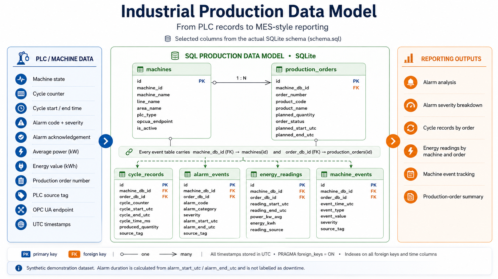
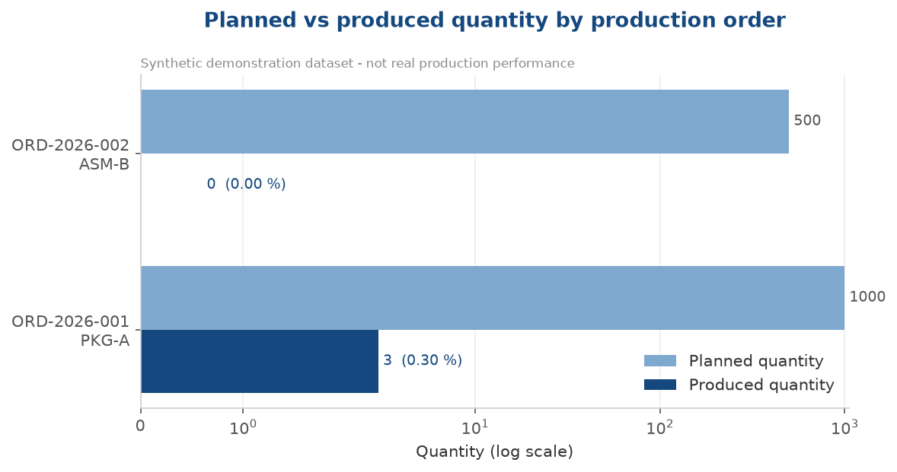
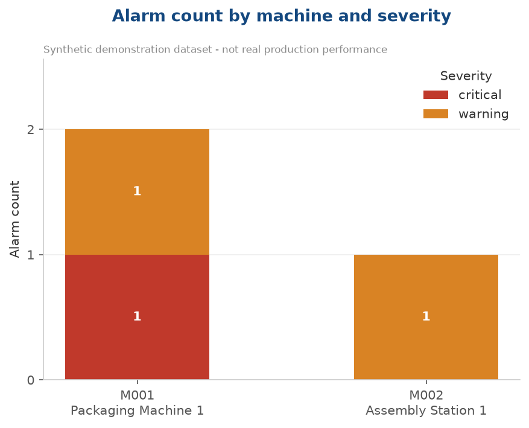
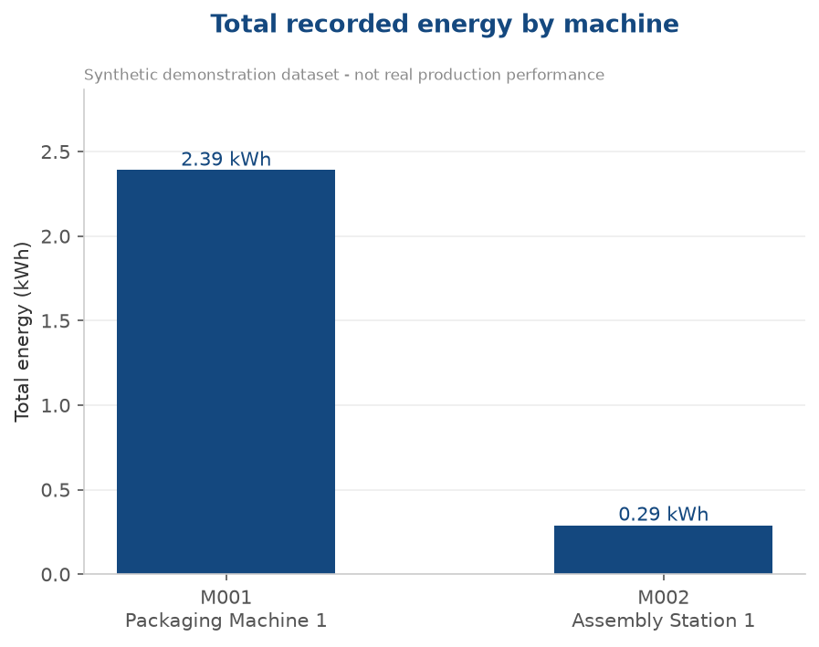
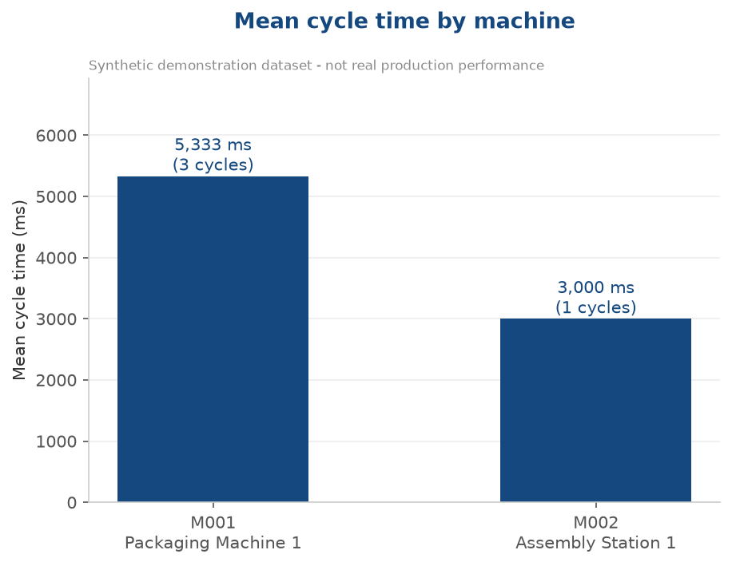

# Industrial Production Data Model and Analysis Workflow

This project demonstrates a small industrial production-data workflow using SQLite, Python, pandas, and Matplotlib.

The goal is to show how production-related data can be modelled in a relational database, loaded, validated, analyzed, exported as CSV files, visualized, and summarized with an engineering interpretation.

The project is designed as a portfolio example for industrial automation, PLC, and IT/OT data topics.



---

## Project Scenario

The dataset represents a small synthetic production scenario:

- Two machines are included:
  - `M001` Packaging Machine 1
  - `M002` Assembly Station 1
- Two production orders are included.
- The main example event is alarm `ALM-304`, a critical packaging-line fault.
- The analysis reviews machine records, production orders, cycle records, alarm events, energy readings, and machine events.
- The dataset is intentionally small and synthetic.
- The results are not intended to represent real production performance.

---

## Technologies Used

- Python
- pandas
- SQLite
- Matplotlib
- Jupyter Notebook
- SQL

---

## Repository Structure

```text
production-data-model-mes-flow/
├── data/
│   └── generated/                  # Local generated database, ignored by Git
├── docs/
│   ├── analysis_summary.md
│   ├── architecture_overview.md
│   ├── data_dictionary.md
│   ├── opcua_to_database_mapping.md
│   ├── project_summary.md
│   ├── validation_results.md
│   └── images/
│       └── industrial-production-data-model.png
├── notebooks/
│   └── machine_data_analysis.ipynb
├── outputs/
│   ├── figures/
│   │   ├── alarm_count_by_machine.png
│   │   ├── mean_cycle_time_by_machine.png
│   │   ├── production_progress_by_order.png
│   │   └── total_energy_by_machine.png
│   └── tables/
│       ├── analysis_metric_summary.csv
│       ├── export_validation_summary.csv
│       ├── machine_operational_summary.csv
│       ├── production_order_summary.csv
│       └── visualization_export_summary.csv
├── scripts/
│   ├── create_demo_database.py
│   ├── run_example_query.py
│   └── simulate_ingest.py
├── sql/
│   ├── constraint_tests.sql
│   ├── example_query_alarm_energy.sql
│   ├── sample_data.sql
│   ├── schema.sql
│   └── validation_queries.sql
├── .gitignore
├── README.md
└── requirements.txt
```

---

## Data Model

The model is built around two master-data tables and four event tables.

### Master data

**`machines`** — one row per physical machine.
Holds the internal key `id`, the plant machine code `machine_id` (for example `M001`), the machine name, its line and area, the PLC type, the OPC UA endpoint the data is read from, and an active flag.

**`production_orders`** — one row per production order.
Holds `order_number`, the machine the order runs on, product code and name, planned quantity, order status, and both planned and actual start/end timestamps.

### Event data

**`cycle_records`** — one row per machine cycle: cycle counter, start and end timestamp, cycle time in milliseconds, produced quantity, and the PLC source tag the record came from.

**`alarm_events`** — one row per alarm: alarm code and message, category, severity, start and end timestamp, operator acknowledgement, and source tag.

**`energy_readings`** — one row per measurement interval: interval start and end, average power in kW, energy in kWh, and the reading source (`opcua`, `scada`, `meter`, or `simulation`).

**`machine_events`** — one row per operational event: event time, event type (state change, fault, operator action, mode change, maintenance), value, severity, and source tag.

### Keys and relationships

- Every table uses an internal surrogate key `id` (`INTEGER PRIMARY KEY AUTOINCREMENT`).
- `machines.machine_id` and `production_orders.order_number` are the business keys, kept `UNIQUE` and separate from the internal key so that plant codes can change without breaking the joins.
- `production_orders.machine_db_id` references `machines(id)`.
- All four event tables carry `machine_db_id` referencing `machines(id)` and `order_db_id` referencing `production_orders(id)`.

This allows analysis at both machine level and production-order level.

### Design notes

- All timestamps are stored in UTC and named with a `_utc` suffix.
- `PRAGMA foreign_keys = ON` is set, because SQLite does not enforce foreign keys by default.
- `CHECK` constraints restrict order status, alarm category, severity, event type, and reading source to defined value sets.
- Indexes are created on every foreign key and on the timestamp columns used for filtering.
- Alarm duration is not stored. It is calculated from `alarm_start_utc` and `alarm_end_utc` when needed.

---

## How to Reproduce the Demo Database

Install the required packages:

```bash
pip install -r requirements.txt
```

Create the demo SQLite database from the SQL schema and sample data:

```bash
python scripts/create_demo_database.py
```

Expected output:

```text
Demo SQLite database created successfully.
Database file: data/generated/demo_production.db
```

The generated `.db` file is ignored by Git and should not be committed.

---

## Example SQL Query

This query joins every alarm event to the energy readings of the same machine whose measurement interval overlaps the alarm window, and returns the alarm duration together with the energy recorded during that window.

```sql
SELECT
    m.machine_id,
    m.machine_name,
    a.alarm_code,
    a.alarm_category,
    a.severity,
    a.alarm_start_utc,
    a.alarm_end_utc,
    ROUND(
        (julianday(a.alarm_end_utc) - julianday(a.alarm_start_utc)) * 1440.0,
        2
    )                                AS alarm_minutes,
    COUNT(e.id)                      AS overlapping_energy_readings,
    ROUND(SUM(e.energy_kwh), 3)      AS energy_kwh_in_alarm_window,
    ROUND(AVG(e.power_kw_avg), 3)    AS avg_power_kw_in_alarm_window
FROM alarm_events AS a
JOIN machines AS m
    ON m.id = a.machine_db_id
LEFT JOIN energy_readings AS e
    ON  e.machine_db_id     = a.machine_db_id
    AND e.reading_start_utc <  a.alarm_end_utc
    AND e.reading_end_utc   >  a.alarm_start_utc
GROUP BY a.id
ORDER BY a.alarm_start_utc;
```

Notes on the query:

- `julianday()` converts an ISO timestamp into a fractional day number, so the difference multiplied by `1440` gives minutes.
- The two interval conditions are the standard overlap test: two intervals overlap when each one starts before the other ends.
- `LEFT JOIN` keeps alarms that have no overlapping energy reading instead of dropping them.
- `alarm_end_utc` is nullable. An alarm that is still open returns `NULL` for `alarm_minutes`.

Run it with:

```bash
python scripts/run_example_query.py
```

Result:

| machine_id | machine_name | alarm_code | alarm_category | severity | alarm_start_utc | alarm_end_utc | alarm_minutes | overlapping_energy_readings | energy_kwh_in_alarm_window | avg_power_kw_in_alarm_window |
|---|---|---|---|---|---|---|---|---|---|---|
| M001 | Packaging Machine 1 | ALM-120 | process | warning | 2026-06-01 07:15:00+00:00 | 2026-06-01 07:18:00+00:00 | 3.0 | 0 | NULL | NULL |
| M001 | Packaging Machine 1 | ALM-304 | process | critical | 2026-06-01 08:30:00+00:00 | 2026-06-01 08:42:00+00:00 | 12.0 | 1 | 0.17 | 2.0 |
| M002 | Assembly Station 1 | ALM-010 | safety | warning | 2026-06-01 13:45:00+00:00 | 2026-06-01 13:48:00+00:00 | 3.0 | 1 | 0.29 | 1.75 |

Three alarms are returned. `ALM-120` has no energy reading whose measurement interval overlaps its three-minute window, so the aggregate columns are `NULL` rather than `0`. In the sample data there is simply no measurement covering that period, which is not the same as a measured value of zero. `ALM-304`, the critical packaging-line fault, lasted twelve minutes and overlaps one energy reading.

The energy value is the energy recorded in the same time window as the alarm. It is a temporal correlation, not proof that the alarm caused the change.

---

## How to Run the Analysis

Open the notebook:

```text
notebooks/machine_data_analysis.ipynb
```

Then run all cells. The notebook performs the following workflow:

1. Detects the project root and database path.
2. Connects to SQLite.
3. Discovers and loads database tables.
4. Validates table structure and data quality.
5. Previews key tables.
6. Analyzes production-cycle duration.
7. Analyzes alarm events.
8. Reviews energy readings around the selected fault window.
9. Builds a machine-level operational summary.
10. Builds a production-order-level summary.
11. Validates exported output files.
12. Creates basic in-notebook visualizations.
13. Generates a final engineering interpretation.

---

## Generated Outputs

The notebook exports reusable CSV files:

```text
outputs/tables/
├── analysis_metric_summary.csv
├── export_validation_summary.csv
├── machine_operational_summary.csv
├── production_order_summary.csv
└── visualization_export_summary.csv
```

The four report figures are generated separately by `scripts/make_figures.py`, which reads the database directly:

```bash
python scripts/make_figures.py
```

It writes:

```text
outputs/figures/
├── alarm_count_by_machine.png
├── mean_cycle_time_by_machine.png
├── production_progress_by_order.png
└── total_energy_by_machine.png
```

---

## Example Visualizations

The charts below are generated from the small synthetic dataset described above. They demonstrate the export path of the workflow, not real production performance.

### Production Progress by Order



### Alarm Count by Machine



### Total Energy by Machine



### Mean Cycle Time by Machine



---

## Key Results from the Sample Dataset

The final analysis summary reports:

- Machines analyzed: `2`
- Active machines: `2`
- Production orders analyzed: `2`
- Total planned quantity: `1500`
- Total produced quantity: `3`
- Overall production progress: `0.20 %`
- Mean order-level progress: `0.15 %`
- Total alarm count: `3`
- Critical alarm count: `1`
- Warning alarm count: `2`
- Total recorded energy: `2.68 kWh`
- Valid CSV exports: `2 of 2`
- Valid figure exports: `4 of 4`

These values are based on a small generated dataset and are intended to demonstrate the workflow rather than evaluate a real production system.

---

## Engineering Interpretation

The project demonstrates how industrial production data from several related tables can be transformed into reusable operational views.

The machine-level summary combines machine master data with cycle counts, produced quantity, alarm counts, energy readings, and machine-event activity.

The production-order summary combines order data with cycle records, alarm records, energy readings, machine events, and machine master data. This makes it possible to review production progress and operational context at order level.

The alarm and energy analysis around `ALM-304` shows how event timestamps and energy readings can be compared in the same workflow. The result should be interpreted as temporal correlation only, not as proof of causation.

---

## Validation Checks

The notebook includes checks for:

- Expected database tables
- Loaded table row and column counts
- Required output variables
- Exported CSV file existence
- Exported CSV row counts
- Required CSV columns
- Exported figure file existence
- Exported figure file size

The project also includes SQL validation files for additional database checks:

- `sql/validation_queries.sql`
- `sql/constraint_tests.sql`

---

## Limitations

This project uses a small synthetic dataset.

The results should not be interpreted as real production KPIs or a real OEE calculation.

A real industrial analysis would require more historical data, validated machine-state information, downtime classification, shift context, quality results, maintenance records, and verified production counters.

Alarm duration is not labeled as downtime, because alarm records alone do not prove that the machine was stopped.

The schema does not contain a target cycle time, so actual cycle time is reported as measured and is not compared against a target.

---

## What This Project Demonstrates

This project demonstrates practical skills in:

- Relational production-data modeling
- SQLite database usage
- SQL schema, constraint, and sample-data design
- Surrogate keys, business keys, and referential integrity
- Python-based data loading
- pandas data validation and transformation
- Machine-level and order-level KPI summaries
- CSV export validation
- Matplotlib visualization
- Engineering interpretation of IT/OT production data
- Reproducible portfolio project structure

---

## Author

Ali Savarnejad

Automation / PLC Engineer with focus on IT/OT, industrial data workflows, machine connectivity, and production-data analysis.
