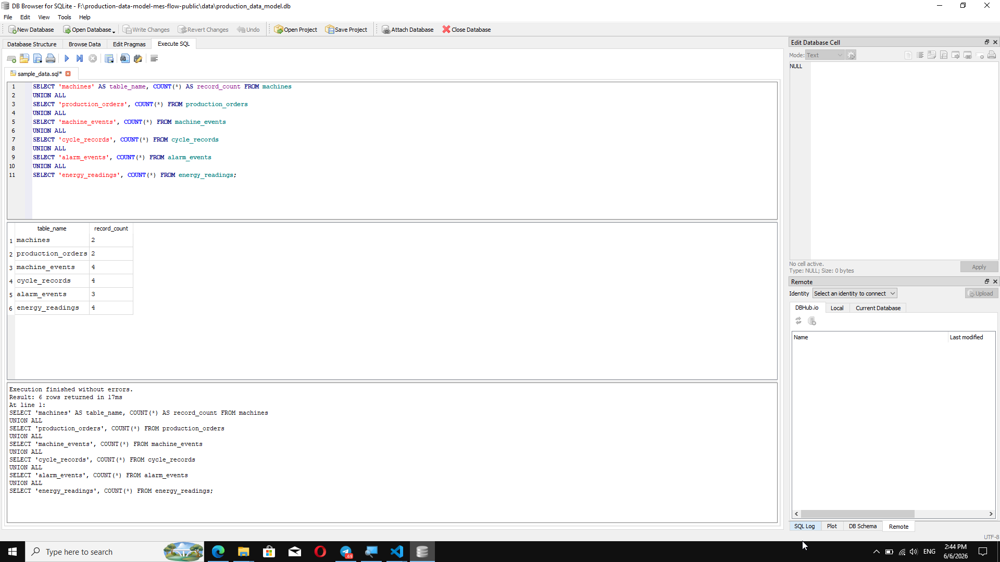
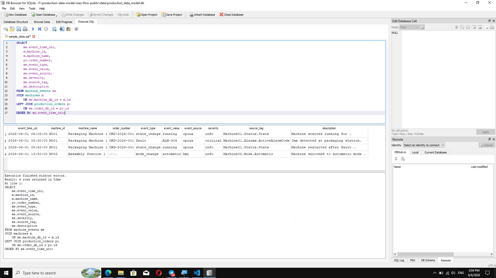
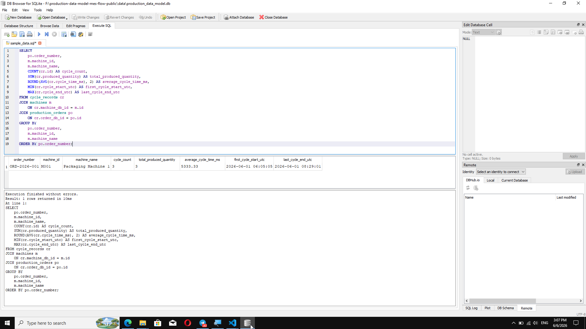
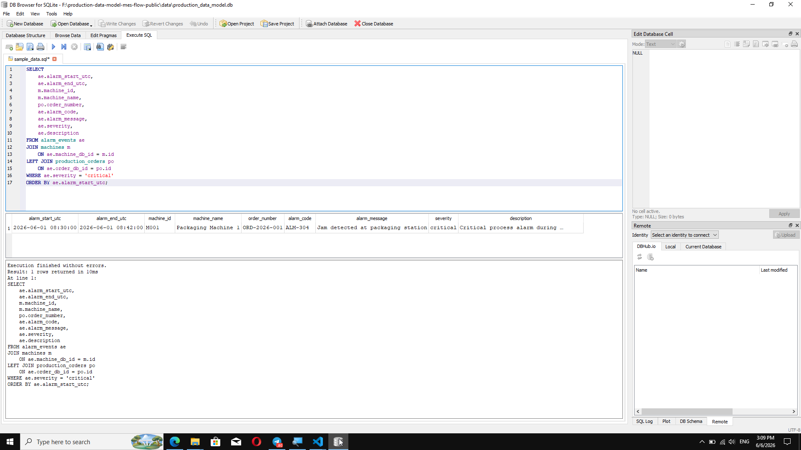
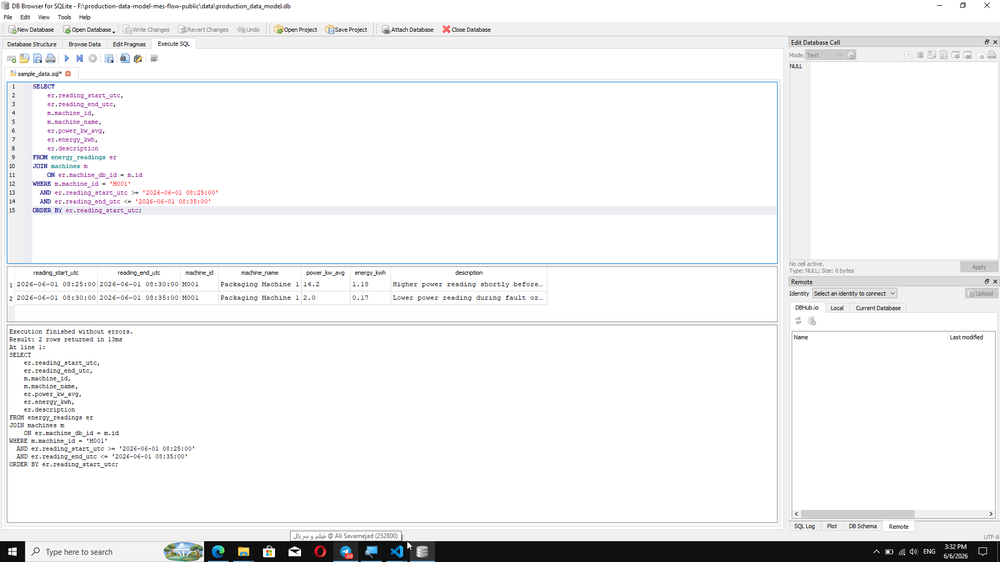
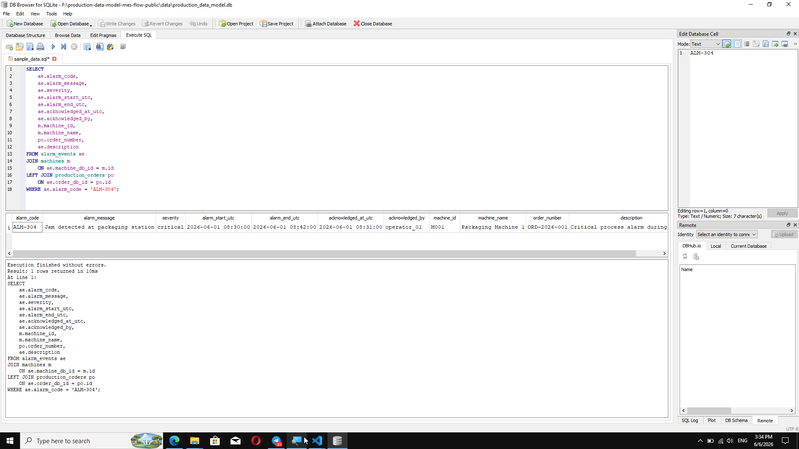
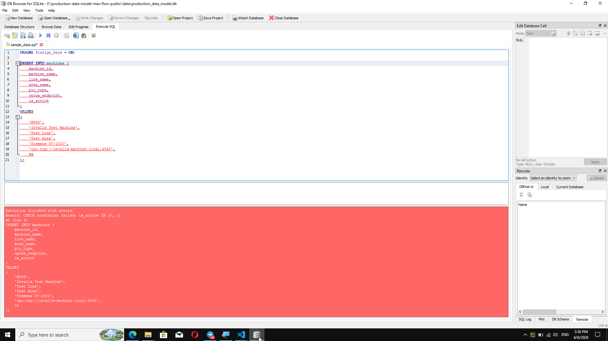
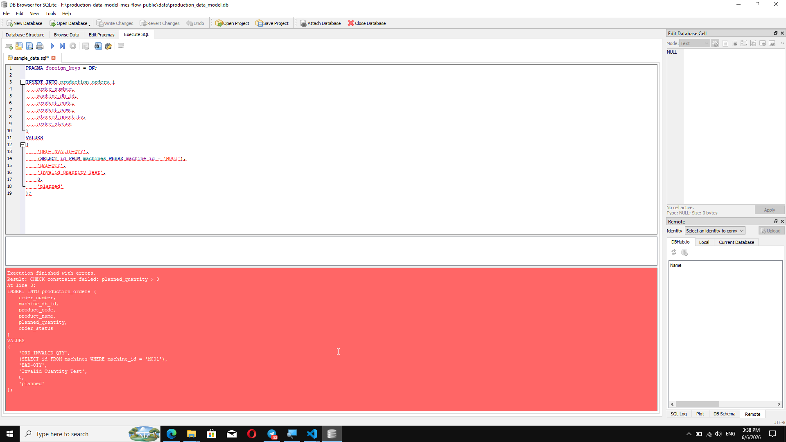
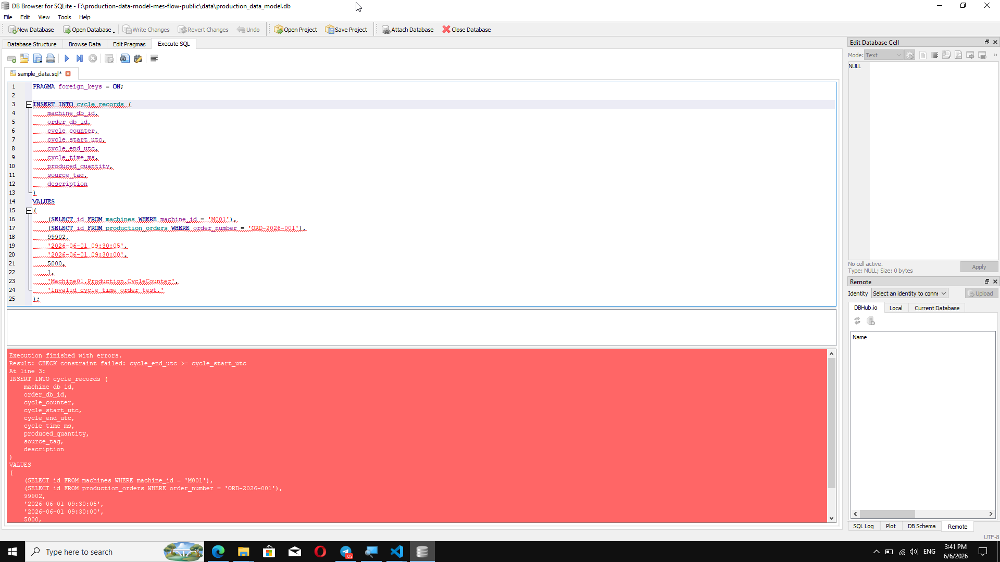
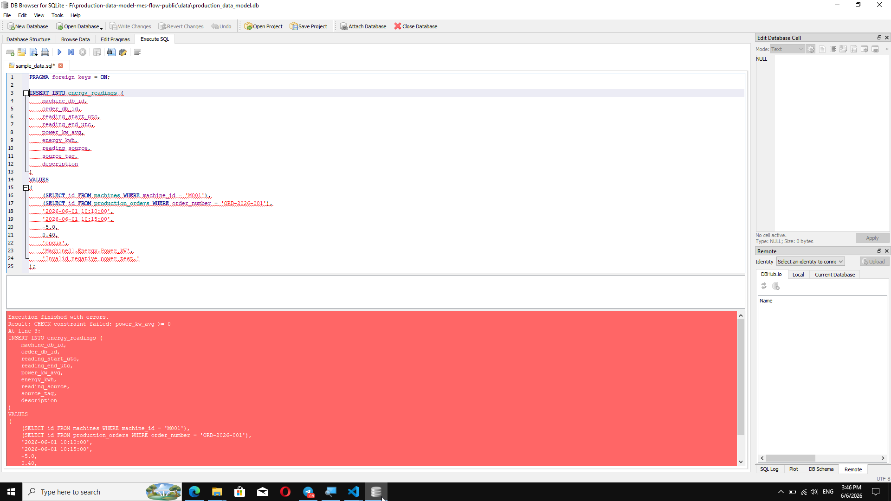

# Validation Results

## Purpose

This document summarizes the validation performed for the Production Data Model and MES/Database Data Flow project.

The goal is to confirm that the database schema, sample data, relationships, queries, and constraints behave as expected.

The validation covers two areas:

1. Functional validation queries
2. Constraint validation tests

Functional validation queries confirm that valid records are inserted, connected, and returned correctly.

Constraint validation tests confirm that invalid records are rejected by the database.

---

# Functional Validation Queries

## 1. Record Counts

### Purpose

This query checks the number of records in each main table.

It confirms that the schema was created successfully and that sample data was inserted into all required tables.

### Expected Result

| Table | Expected record count |
|---|---:|
| `machines` | 2 |
| `production_orders` | 2 |
| `machine_events` | 4 |
| `cycle_records` | 4 |
| `alarm_events` | 3 |
| `energy_readings` | 4 |

### Screenshot



### Result

The query returned the expected record counts for all main tables.

This confirms that the database contains machine master data, production orders, machine events, cycle records, alarm events, and energy readings.

---

## 2. Machine Event Timeline

### Purpose

This query displays a chronological machine event timeline.

It joins:

- `machine_events`
- `machines`
- `production_orders`

The purpose is to confirm that machine events are correctly connected to machine and production order context.

### Key Design Point

`machines` is joined with a normal `JOIN` because every machine event must belong to a known machine.

`production_orders` is joined with a `LEFT JOIN` because some machine events can happen outside an active production order.

### Screenshot



### Result

The query returned the expected timeline for machines `M001` and `M002`.

The timeline includes:

- machine start
- fault event `ALM-304`
- machine restart after fault clearance
- automatic mode change before production

This confirms that the generic machine timeline works correctly.

---

## 3. Cycle Summary by Production Order

### Purpose

This query summarizes production cycle records by production order.

It calculates:

- cycle count
- total produced quantity
- average cycle time
- first cycle start time
- last cycle end time

### Screenshot



### Result

The query returned one summarized result for production order `ORD-2026-001`.

| Metric | Value |
|---|---:|
| Cycle count | 3 |
| Total produced quantity | 3 |
| Average cycle time | 5333.33 ms |

This confirms that cycle records are correctly linked to the production order and can be used for simple production analysis.

---

## 4. Critical Alarms

### Purpose

This query filters structured alarm records by severity.

It shows only alarms where:

```text
severity = critical
```

The purpose is to confirm that the alarm table can be used to identify critical alarm events.

### Screenshot



### Result

The query returned the expected critical alarm:

```text
Alarm code: ALM-304
Alarm message: Jam detected at packaging station
Machine: M001
Production order: ORD-2026-001
Severity: critical
```

This confirms that the alarm lifecycle table can support troubleshooting and alarm reporting.

---

## 5. Energy Around Fault Window

### Purpose

This query checks energy readings around the `ALM-304` fault window.

It filters energy readings for machine `M001` between:

```text
2026-06-01 08:25:00
2026-06-01 08:35:00
```

The purpose is to show how energy behavior can be analyzed around a machine fault.

### Screenshot



### Result

The query returned two energy readings around the fault window.

| Time window | Average power | Description |
|---|---:|---|
| 08:25 - 08:30 | 14.2 kW | Higher power reading shortly before ALM-304 |
| 08:30 - 08:35 | 2.0 kW | Lower power reading during fault or idle period |

This confirms that energy readings can support troubleshooting analysis around machine events.

---

## 6. ALM-304 Full Context

### Purpose

This query retrieves the full context of alarm `ALM-304`.

It joins:

- `alarm_events`
- `machines`
- `production_orders`

The purpose is to show how an alarm can be connected to machine, production order, acknowledgement, and description information.

### Screenshot



### Result

The query returned the expected full alarm context.

| Field | Value |
|---|---|
| Alarm code | `ALM-304` |
| Alarm message | `Jam detected at packaging station` |
| Severity | `critical` |
| Machine | `M001` |
| Machine name | `Packaging Machine 1` |
| Production order | `ORD-2026-001` |
| Acknowledged by | `operator_01` |

This confirms that structured alarm data is correctly linked to machine and production order context.

---

# Constraint Validation Tests

## Purpose

Constraint validation tests confirm that the database rejects invalid records.

These tests intentionally insert incorrect data.

A failed insert is the expected result.

The screenshots for these tests show error messages from SQLite. That is correct behavior because the database is protecting the data model from invalid input.

---

## 1. Invalid Machine Active Status

### Test

This test attempts to insert a machine with:

```text
is_active = 99
```

### Expected Rule

The `is_active` field must only allow:

```text
0 or 1
```

### Expected Result

The insert should fail because of this constraint:

```sql
CHECK(is_active IN (0, 1))
```

### Screenshot



### Result

The database rejected the invalid machine record.

This confirms that the machine active status constraint works correctly.

---

## 2. Invalid Production Order Quantity

### Test

This test attempts to insert a production order with:

```text
planned_quantity = 0
```

### Expected Rule

A production order must have a planned quantity greater than zero.

### Expected Result

The insert should fail because of this constraint:

```sql
CHECK(planned_quantity > 0)
```

### Screenshot



### Result

The database rejected the invalid production order.

This confirms that production orders cannot be created with zero planned quantity.

---

## 3. Invalid Cycle Time Order

### Test

This test attempts to insert a cycle record where the end time is earlier than the start time.

```text
cycle_start_utc = 2026-06-01 09:30:05
cycle_end_utc   = 2026-06-01 09:30:00
```

### Expected Rule

The cycle end timestamp must not be earlier than the cycle start timestamp.

### Expected Result

The insert should fail because of this constraint:

```sql
CHECK(cycle_end_utc >= cycle_start_utc)
```

### Screenshot



### Result

The database rejected the invalid cycle record.

This confirms that logically impossible cycle records are not accepted.

---

## 4. Invalid Energy Value

### Test

This test attempts to insert an energy reading with:

```text
power_kw_avg = -5.0
```

### Expected Rule

Average power must not be negative in this simplified energy reading model.

### Expected Result

The insert should fail because of this constraint:

```sql
CHECK(power_kw_avg >= 0)
```

### Screenshot



### Result

The database rejected the invalid energy reading.

This confirms that negative power values are not accepted.

---

# Validation Summary

The validation results confirm that:

- all main tables were created successfully
- sample data was inserted correctly
- table relationships work through foreign keys
- machine events can be displayed as a timeline
- production cycles can be summarized by order
- critical alarms can be filtered
- energy readings can be analyzed around a fault window
- alarm context can be connected to machine and production order data
- invalid records are rejected by database constraints

The validation supports the main purpose of the project: showing how selected machine and production data can be structured into a database model for MES-style reporting, troubleshooting, and later IT/OT analytics.

---

# Scope of Validation

This validation confirms the behavior of a simplified SQLite-based portfolio database.

It does not validate:

- live OPC UA communication
- real PLC connectivity
- production-scale performance
- real-time data collection
- dashboard visualization
- OEE calculation
- production MES deployment

The validation focuses on database structure, relationships, sample data, queries, and constraints.